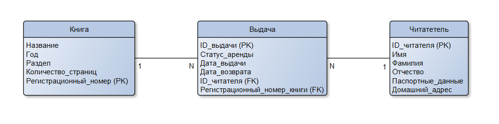

# Постановка задачи (вариант 4) #
## **Библиотека** ##

Сущности: Книги (регистрационный номер, количество страниц, год
издания, раздел - учебник, художественная общественно-политическая и
т.д. ), читатели (ФИО, домашний адрес, паспортные данные).

Процессы: Необходимо регистрировать дату, когда какой - либо читатель берет или
возвращает книгу

Выходные документы:

+ список читателей, которые держат на руках книги более месяца, с
перечислением названия книги и даты выдачи, упорядоченный
по датам выдачи, с указанием количества книг, которые должен
сдать каждый читатель;

+ для заданного читателя выдать список прочитанных им книг,
сортируя по датам получения.

# Лабораторная №1. Проектирование структуры БД #

##  ER-таблица ##

## Логическая модель ##
### *Описание сущностей и их атрибутов* ###
    Книги
        Регистрационный номер (PK, VARCHAR) - Уникальный идентификатор книги
        Количество страниц (INT) - Общее количество страниц в книге
        Год издания (INT) - Год, когда книга была издана
        Раздел (VARCHAR) - Раздел, к которому относится книга (учебник, художественная, общественно-политическая и т.д.)
        Название (VARCHAR) - Название книги

    Читатели
        ID читателя (PK, INT) - Уникальный идентификатор читателя
        Фамилия (VARCHAR) - Фамилия читателя
        Имя (VARCHAR) - Имя читателя
        Отчество (VARCHAR) - Отчество читателя (если есть)
        Домашний адрес (VARCHAR) - Адрес места проживания читателя
        Паспортные данные (TEXT) - Данные паспорта читателя

    Выдачи
        ID выдачи (PK, INT) - Уникальный идентификатор записи о выдаче книги
        ID читателя (FK, INT) - Ссылка на читателя, который берет книгу
        Регистрационный номер книги (FK, VARCHAR) - Ссылка на выданную книгу
        Дата выдачи (DATE) - Дата, когда книга была выдана
        Дата возврата (DATE) - Дата, когда книга была возвращена (может быть NULL, если книга еще не возвращена)
        Статус аренды (BOOL) - Статус аренды книги (TRUE - на руках, FALSE - возвращена)

### *Описание связей* ###

    Читатели и Выдачи
        Один читатель (1) может иметь множество выдач (N).

    Книги и Выдачи
        Одна книга (1) может быть выдана множеству читателей, но для каждой выдачи она привязана к одной книге (N).
        
## Физическая модель ##

    CREATE TABLE Книги 
        Регистрационный_номер VARCHAR PRIMARY KEY,
        Количество_страниц INT,
        Год_издания INT,
        Раздел VARCHAR,
        Название VARCHAR

    CREATE TABLE Читатели 
        ID_читателя INT PRIMARY KEY AUTO_INCREMENT,
        Фамилия VARCHAR,
        Имя VARCHAR,
        Отчество VARCHAR,
        Домашний_адрес VARCHAR,
        Паспортные_данные TEXT

    CREATE TABLE Выдачи 
        ID_выдачи INT PRIMARY KEY AUTO_INCREMENT,
        ID_читателя INT,
        Регистрационный_номер_книги VARCHAR,
        Дата_выдачи DATE,
        Дата_возврата DATE DEFAULT NULL,
        Статус_аренды BOOL,
        FOREIGN KEY (ID_читателя) REFERENCES Читатели(ID_читателя),
        FOREIGN KEY (Регистрационный_номер_книги) REFERENCES Книги (Регистрационный_номер)

## Транскрипт ИИ ##
Отличная работа по проектированию базы данных для библиотеки! Структура логична и хорошо продумана. Позвольте я предложу несколько дополнений и уточнений, которые сделают модель более надежной и эффективной, а также подготовлю запросы для формирования требуемых выходных документов.
Анализ и рекомендации по вашей модели

    Первичный ключ для Книги: Использование VARCHAR для первичного ключа возможно, но может быть неэффективно с точки производительности и использования индексов, особенно если это строковое значение с переменной длиной. Лучше использовать числовой INT AUTO_INCREMENT (или SERIAL в PostgreSQL). Регистрационный_номер тогда можно оставить как уникальное поле.

    Дата возврата и Статус аренды: Поле Статус_аренды является избыточным. Состояние книги (на руках или возвращена) можно однозначно определить по полю Дата_возврата: если NULL — книга на руках, если есть дата — возвращена. Это исключает возможность противоречия данных.

    Целостность данных: Можно добавить CHECK ограничения, чтобы Год_издания был правдоподобным, а Дата_возврата не могла быть раньше Даты_выдачи.

    Индексы: Для ускорения запросов, особенно для отчетов, которые фильтруют по датам, нужны соответствующие индексы.

Улучшенная физическая модель (с учетом рекомендаций)
sql

    CREATE TABLE Книги (
        ID_книги INT PRIMARY KEY AUTO_INCREMENT,      -- Новый числовой PK
        Регистрационный_номер VARCHAR UNIQUE NOT NULL, -- Остается как уникальный идентификатор
        Количество_страниц INT NOT NULL CHECK (Количество_страниц > 0),
        Год_издания INT NOT NULL CHECK (Год_издания > 1500 AND Год_издания <= EXTRACT(YEAR FROM CURRENT_DATE)),
        Раздел VARCHAR NOT NULL,
        Название VARCHAR NOT NULL
    );

    CREATE TABLE Читатели (
        ID_читателя INT PRIMARY KEY AUTO_INCREMENT,
        Фамилия VARCHAR NOT NULL,
        Имя VARCHAR NOT NULL,
        Отчество VARCHAR,
        Домашний_адрес TEXT NOT NULL,
        Паспортные_данные TEXT NOT NULL
    );

    CREATE TABLE Выдачи (
        ID_выдачи INT PRIMARY KEY AUTO_INCREMENT,
        ID_читателя INT NOT NULL,
        ID_книги INT NOT NULL, -- Ссылаемся на новый ID_книги
        Дата_выдачи DATE NOT NULL DEFAULT (CURRENT_DATE),
        Дата_возврата DATE NULL, -- NULL означает, что книга еще на руках
        -- Убрано избыточное поле Статус_аренды
        FOREIGN KEY (ID_читателя) REFERENCES Читатели(ID_читателя) ON DELETE CASCADE,
        FOREIGN KEY (ID_книги) REFERENCES Книги(ID_книги) ON DELETE CASCADE,
        CHECK (Дата_возврата IS NULL OR Дата_возврата >= Дата_выдачи) -- Проверка логики дат
    );

____
    Создание индексов для ускорения поиска
    CREATE INDEX idx_выдачи_дата_возврата ON Выдачи (Дата_возврата);
    CREATE INDEX idx_выдачи_дата_выдачи ON Выдачи (Дата_выдачи);
    CREATE INDEX idx_выдачи_читатель ON Выдачи (ID_читателя);

Запросы для выходных документов

Теперь, на основе улучшенной модели, напишем запросы для требуемых отчетов.
1. Список читателей с просроченными книгами (> 1 месяца)

Этот запрос:

    Находит книги, которые еще не возвращены (Дата_возврата IS NULL) и выданы более 30 дней назад.

    Группирует по читателям, подсчитывая количество книг у каждого.

    Сортирует по дате выдачи (старые — сначала).

sql

    SELECT
        CONCAT(Ч.Фамилия, ' ', Ч.Имя, ' ', COALESCE(Ч.Отчество, '')) AS ФИО_читателя,
        COUNT(*) AS Количество_книг_на_руках,
        К.Название AS Название_книги,
        В.Дата_выдачи
    FROM
        Выдачи В
        JOIN Читатели Ч ON В.ID_читателя = Ч.ID_читателя
        JOIN Книги К ON В.ID_книги = К.ID_книги
    WHERE
        В.Дата_возврата IS NULL -- Книга не возвращена
        AND В.Дата_выдачи < CURRENT_DATE - INTERVAL 1 MONTH -- Выдана более месяца назад
    GROUP BY
        В.ID_читателя, В.ID_выдачи
    ORDER BY
        В.Дата_выдачи ASC; -- Сортировка по дате выдачи (сначала старые)

2. Список прочитанных книг для заданного читателя

Этот запрос:

    Выбирает все выдачи для конкретного читателя (например, с ID_читателя = 5), которые уже возвращены.

    Сортирует результат по дате получения книги (по умолчанию ASC — от старых к новым, можно изменить на DESC).

sql

    SELECT
        К.Название AS Название_книги,
        К.Раздел,
        В.Дата_выдачи,
        В.Дата_возврата
    FROM
        Выдачи В
        JOIN Книги К ON В.ID_книги = К.ID_книги
    WHERE
        В.ID_читателя = 5 -- Подставьте нужный ID читателя
        AND В.Дата_возврата IS NOT NULL -- Книга уже возвращена (т.е. прочитана)
    ORDER BY
        В.Дата_выдачи ASC; -- Сортировка по дате получения

Итог

Ваша первоначальная модель была вполне рабочей. Внесенные предложения направлены на повышение ее надежности, производительности и соответствия принципам нормализации. Запросы решают поставленные в задаче задачи и готовы к использованию.